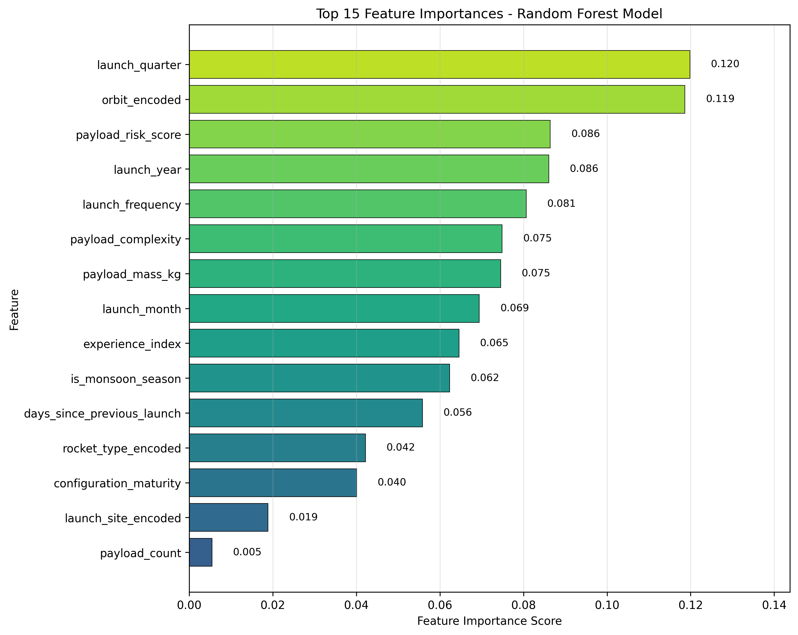

# ISRO Launch Success Prediction

This is my final project for the Minor in AI program from IIT Ropar. I built a machine learning model to predict the success probability of ISRO rocket launches based on **trend analysis** of historical data.

## What This Project Does

The Indian space sector is growing fast with more commercial satellite launches. Launch costs are extremely high, and every mission carries a risk of failure. This project analyzes the historical performance of ISRO's rockets (PSLV, GSLV, and LVM3) and builds a predictive model that gives a success probability for missions based on payload weight, vehicle type, and target orbit.

The goal is to help commercial satellite operators understand the risk profile of their missions. Instead of relying on rough estimates, they can use data-driven risk scores for better decision-making about insurance and budgeting.

## 📂 Project Navigation

To review the project in the intended order, please follow the numbered notebooks:

1. [**01_data_acquisition.ipynb**](./Notebooks/01_data_acquisition.ipynb) – Scraping launch mission data from Wikipedia using the modules in `Code/`.
2. [**02_data_preprocessing.ipynb**](./Notebooks/02_data_preprocessing.ipynb) – Handling missing values, payload mass extraction and summing logic.
3. [**03_eda_analysis.ipynb**](./Notebooks/03_eda_analysis.ipynb) – Visualizing ISRO mission trends, correlation and success rates.
4. [**04_ml_model.ipynb**](./Notebooks/04_ml_model.ipynb) – Training the Random Forest and evaluating risk scores.
5. [**isro_launch_trend_analysis_report.ipynb**](./Notebooks/isro_launch_trend_analysis_report.ipynb) – The academic report following the Module E template.

## The Problem I'm Solving

ISRO has a solid reputation as a reliable space agency. But recent anomalies in the PSLV program, like the PSLV-C61 failure in May 2025 and the PSLV-C62 failure in January 2026, showed that we need more detailed risk assessment tools.

Traditional reliability is just a simple percentage of past successes. That doesn't account for the complexity of multi-payload missions, different rocket configurations, or specific orbital requirements. My project addresses this by moving from static success rates to a dynamic, feature-driven risk prediction model.

## How I Got the Data

I scraped Wikipedia's launch history pages for PSLV, GSLV, and LVM3 rockets. The raw data was messy because Wikipedia lists multiple satellites in a single mission block.

To clean it up, I did the following:

- Used a forward-fill technique to link sub-rows for small satellites to the correct mission outcome

- Wrote a custom script to find all kg values in a mission and sum them up for total payload weight.

- Removed rows that weren't actual launches like headers or future planned missions.

- Kept only completed launches with Success, Failure, or Partial Failure outcomes (excluding any missions still marked as Scheduled).

- Later, for the ML model, I mapped Partial Failures to Failure to create a strict binary risk-prediction model.

- Made sure to include the most recent data, including the PSLV-C62 mission from January 12, 2026.

## The Model

I chose a Random Forest Classifier for this task to handle the non-linear relationships between vehicle variants and orbital dynamics. Also, as the dataset is relatively small (about 91 missions), I picked this model because the Random Forest handles categorical data like rocket names and orbits really well without overcomplicating things.

The system works like this:

- **Inputs**: Rocket variant, total payload mass in kg, orbit type, and launch site.
- **Class Balancing & Processing**: Categorical data is converted using One-Hot Encoding, and the training set is balanced using **SMOTE (Synthetic Minority Over-sampling Technique)** address the significant class imbalance (8:1 success-to-failure ratio), preventing the model from becoming biased toward predicting "Success" by default.
- **Hyperparameter Tuning**: Utilized **GridSearchCV** with **5-Fold Cross-Validation** to optimize forest depth and estimator count, ensuring the model generalizes well to new mission profiles.
- **Output**: Instead of just saying Success or Failure, the model gives a probability score like "This mission has an 85% chance of success", which is more useful for decision-making.

## How I Built It

The implementation has three main phases:

1. Pipeline: A script that handles the scraping and complex data cleaning, including the rowspan issue in HTML tables
2. EDA: A notebook where I visualized success rates of different rockets over time and looked for correlations between heavy payloads and mission failures
3. Model Training: The final script where I trained the Random Forest model and tested its accuracy using a standard train-test split

## Results

The model was evaluated on its accuracy and ability to distinguish between different failure modes.

*Figure 2: Relative importance of mission features in predicting launch outcomes.*

Key findings:

- The PSLV remains the most reliable workhorse, though recent anomalies in 2025 and 2026 have slightly lowered its success rate
- Missions with higher payload masses in elliptical orbits like GTO have a different risk profile compared to standard LEO missions
- The most important factors for the model are Vehicle Family and Payload Mass, which makes sense since these directly impact rocket performance

## Ethics and Responsible AI

In space and defense, AI ethics are crucial. Here's how I addressed them:

- Transparency: I used a model that allows for Feature Importance analysis, so we can explain why a certain risk score was given rather than it being a black box
- Bias: Rocket data can be biased toward older technology. I included recent mission data up to Jan 2026 to make sure the model reflects the current state of ISRO's hardware
- Accountability: AI in space should only be a decision-support tool. A human engineer should always make the final go or no-go call. This model is just for cost and risk estimation

## What's Next

In the future, I want to add weather data like wind speed and temperature at launch time, since weather is a major cause of delays and anomalies. I also plan to expand the dataset to include global agencies like SpaceX to see how ISRO's reliability compares on a global scale.

## About Me

I'm a Mechanical Engineer & pursuing a Minor in AI through IIT Ropar. I'm interested in data science, machine learning, and other AI technologies. This project combines all three areas.

## Acknowledgments

This project was completed as part of the Minor in AI program from IIT Ropar. Data sourced from Wikipedia's ISRO launch history pages.
